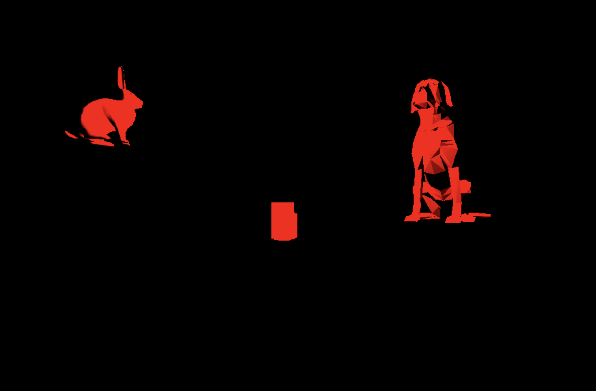

## CMPM163Labs
# Lab2:
https://drive.google.com/file/d/1RwdsM1b4OBfUhCkWANv7oJh_5HeuHIQH/view?usp=sharing

# Lab3:
https://drive.google.com/file/d/1vt_a_YCYabmvywWP2bbLoRoZ8D0obmNp/view?usp=sharing
The cube on the left and the cube in the middle I created by following the lab document. The cube on the right I created using a new material, changed the color and set its wiremesh = to true. The cube on the bottom that has changing colors I made by making two new shader files. Then inside of the animate function I have a counter that goes from 0 to 1 by .005 and each time updates the red and green values for one of the cubes colors causing the color changing effect.

# Lab4:
24a. To find the x coordinate we would take the floor of 7 * u.  
24b. To find the y coordinate value we would take the floor of -7v + 7.  
24c. from (.375, .25) on the uv grid I got (2, 5) on the texture resulting in the color gray.
